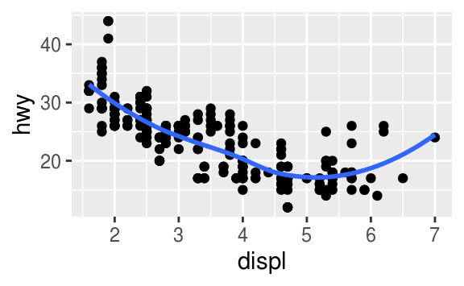
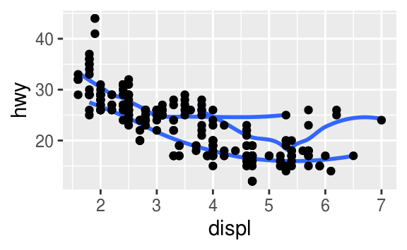
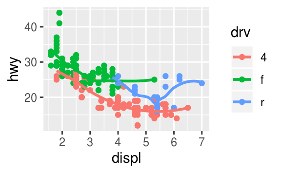
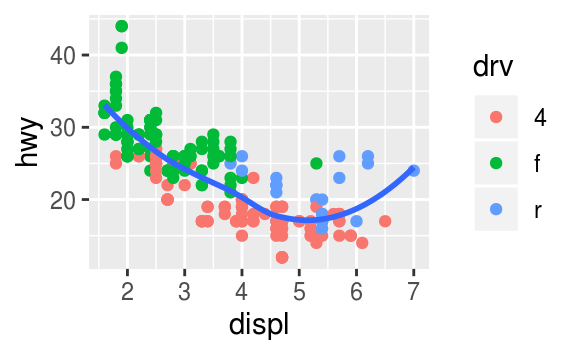
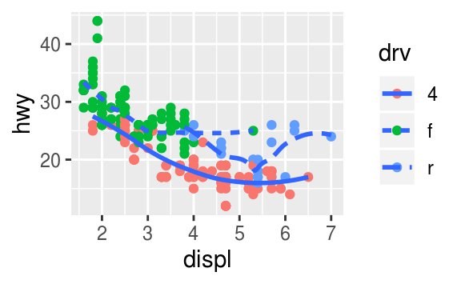
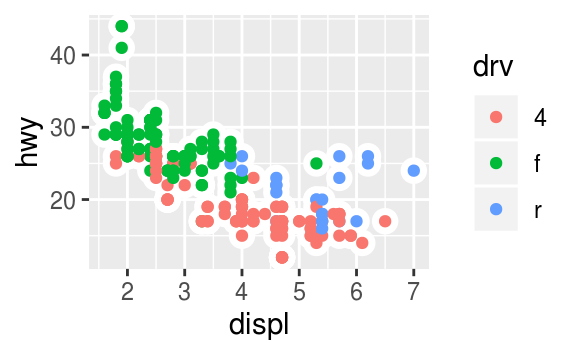

**Reg. No:** 
**Q.P. Code:** 

# M.Sc Computer Science

### Model Examinations – Jan. 2022
### 2021-23 Batch

**Subject:** R for Data Science

**Date:** 31/01/2022
**Time:** 3 Hours 							  	
**Maximum:** 50 marks

### Attach the necessary pacakges and datasets

```{r include=FALSE}
library(tidyverse)
library(nycflights13)
```

### PART –A (4x5 = 20 Marks)
#### (Answer any 4 Questions out of 5)

1. What does the stroke aesthetic do? What shape does it work with?

```{r}

```


2. What does geom_col() do? How is it different from geom_bar()?

```{r}

```

3. Find all flights that: 

a. arrived more than two hours late, but didn't leave late

```{r}

```

b. Departed in summer(July, August and September)

```{r}

```

4. How could you use arrange() to sort all missing values to the start?

```{r}

```

5. Sort flights to find the fastest flights.

```{r}

```

### PART –B (3 x 10 = 30 Marks)
#### (Answer Any 3 Questions out of 4)

1. Re-create the R code necessary to generate the following graphs.
  
```{r}
```

  
  
  
```{r}
```
  
  
  
  
  
```{r}
```
  
  
  
  
```{r}
```
  
  
  
  
```{r}
```
  
  
  
  
```{r}
```
  
  
  

2. Find all flights that:

a. Were delayed by at least an hour, but made up over 30 minutes in flight

```{r}

```

b. Departed between midnight and 6 a.m (inclusive)

```{r}

```


3. Currently dep_time and sched_dep_time are convenient to look at, but hard to compute with because they're not really continuous numbers. Convert them to a more convenient representation of number of minutes since midnight.

```{r}

```


4. 
a. Compare dep_time, sched_dep_time, and dep_delay. How would you expect those three numbers to be related?

```{r}

```

b. Find the 10 most delayed flights using a ranking function. How do you want to handle ties? Carefully read the documentation for min_rank().

```{r}

```

